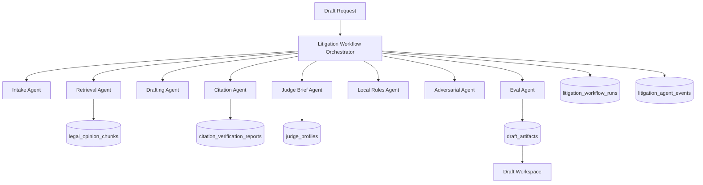

# LexOrchestrator — Architecture

## System Overview

LexOrchestrator is a Next.js 16 application with two parallel multi-agent pipelines and a stdio MCP server. All components run from the same codebase. Neither pipeline modifies the other.

- **Legacy pipeline** (`/research`, `/runs`): Seven sequential agents for legal research queries.
- **Litigation workflow** (`/draft`, `/workflows`, `/evals`): Eight specialist agents for motion drafting.
- **MCP server** (`mcp/server.ts`): Nine tools over stdio for AI clients.

---

## Agent Topology

### Legacy Seven-Agent Pipeline

Entry point: `lib/orchestrator/runOrchestration.ts`
Route: `POST /api/orchestrate`

```
Intake Agent
  → Retrieval Agent (hybrid RAG over document_chunks)
  → Citation Validator
  → Adversarial Review
  → Hallucination Monitor
  → Final Synthesis
  → Eval Engine
```

### Litigation Workflow (Eight Agents)

Entry point: `lib/litigation/runLitigationWorkflow.ts`
Route: `POST /api/litigation/workflows`

```
Intake Agent        normalize motionType, jurisdiction, keyFacts, legalIssues
  → Retrieval Agent     hybrid RAG over legal_opinion_chunks
  → Drafting Agent      LLM outline grounded in retrieved authority; deterministic fallback
  → Citation Agent      verifyCitationsInText on draft output
  → Adversarial Agent   red-team critique; playbook fallback by motion type
  → Local Rules Agent   section detection + formatting warnings; static profile data
  → Judge Brief Agent   DB lookup by name/ID; deterministic fallback with court-level guidance
  → Eval Agent          computeWorkflowEval over in-memory outputs; no LLM dependency
```

Agents run sequentially. The `AgentContext` object is built progressively -- each agent receives what prior agents produced.

---

## Data Flow



---

## Retrieval Scoring Formula

Litigation workflow retrieval (`lib/retrieval/searchLegalOpinions.ts`):

```
finalScore = min(1,
  keywordScore * 0.35
  + vectorScore * 0.45
  + jurisdictionBoost    (0.08 if match)
  + courtBoost           (0.06 if match)
  + citationBoost        (0.05 if citation present)
  + recencyBoost         (0.03 if <= 5 years, 0.01 if <= 15 years)
)
```

Fallback chain: `hybrid_rag` → `keyword_only` → `direct_query` → `empty`

---

## Eval Confidence Formula

`lib/litigation/evals/computeWorkflowEval.ts`:

```
overallConfidence =
  citationPassRate      * 0.35
  + faithfulnessScore   * 0.25
  + retrievalCoverage   * 0.15
  + localRulesComp      * 0.10
  + adversarialSafety   * 0.10
  + judgeScore          * 0.05
```

`passFail`: "pass" if confidence >= 0.75 AND zero failed citations; "warn" if >= 0.55; "fail" otherwise.

---

## Persistence Model

All inserts gracefully no-op when Supabase is unavailable. The workflow still completes and returns in-memory results.

| Operation | Table | No-op if unavailable |
|---|---|---|
| Create workflow run | `litigation_workflow_runs` | Yes, returns ephemeral UUID |
| Log agent event | `litigation_agent_events` | Yes |
| Save draft artifact | `draft_artifacts` | Yes, returns local object |
| Save citation report | `citation_verification_reports` | Yes |
| Update run scores | `litigation_workflow_runs` | Yes |

DB reads return empty arrays or null when unavailable. UI degrades to empty-state messages.

---

## LLM Configuration

`lib/llm/config.ts` auto-detects provider:
- `OPENROUTER_API_KEY` present → OpenRouter
- `OPENAI_API_KEY` starts with `sk-or-` → OpenRouter (sets `baseURL` and headers)
- `OPENAI_API_KEY` present (standard key) → OpenAI direct

Without any key: agents return deterministic keyword-based fallback outputs. Embeddings use FNV-1a hash fallback (not semantically meaningful).

---

## MCP Integration

`mcp/server.ts` uses `McpServer` from `@modelcontextprotocol/sdk` with `StdioServerTransport`.

Env vars are loaded via dotenv before any tool module is imported, ensuring DB and LLM env vars are available when `lib/db/supabaseServer.ts` is evaluated. Tool files use static imports of lib modules.

All tool callbacks return `{ content: [{ type: "text", text: JSON.stringify(...) }] }`. Errors return `isError: true` with a structured message instead of throwing.

---

## Security and Safety

- `lib/db/supabaseServer.ts` is server-only and uses `SUPABASE_SERVICE_ROLE_KEY`. It is never imported from client components.
- `scripts/check-safety.ts` scans all tracked files for forbidden employer terms and secret patterns before every commit.
- `.env` and `.env.local` are gitignored; the check script fails if they are tracked.
- No MCP README or docs contain real keys -- only placeholder strings.

---

## Citation Extraction Topology (Phase 15)

All citation extraction is routed through `lib/citations/citationExtractorAdapter.ts`:

```
App code (route, agent, MCP tool)
  → extractCitationsWithBestAvailableProvider(text)
      ├── CITATION_WORKER_URL set?
      │     ├── Yes → POST workers/citation/app.py /extract (2s timeout)
      │     │           ├── Success → citations with extractorSource: "eyecite"
      │     │           └── Failure → fall through to regex
      │     └── No  → fall through to regex
      └── extractCitations(text) → citations with extractorSource: "regex"
```

`CITATION_WORKER_URL` is the only env var needed to enable the eyecite path. When unset or when the worker is unreachable, the app uses the regex extractor silently. No crash, no configuration change required.

Worker health: `GET /api/citations/worker-health`

---

## Draft Export Topology (Phase 17)

All export requests flow through `lib/exports/exportDraft.ts`:

```
GET /api/drafts/[id]/export?format=pdf&...
  -> exportDraft({ workflowRunId, format, options })
       -> buildDraftExportPayload(workflowRunId)
            -> getDraftWorkspace(id)   (workspace + artifacts)
            -> getEditableDraft(id)    (latest revision content)
            Content priority: latestRevision -> primaryDraft -> workflow.final_output -> ""
       -> exportTxt(payload, options)   returns Buffer (sync)
       -> exportDocx(payload, options)  returns Promise<Buffer> (docx package)
       -> exportPdf(payload, options)   returns Promise<Buffer> (pdfkit, dynamic import)
  -> new Response(buffer, { Content-Type, Content-Disposition: attachment })
```

`pdfkit` is dynamically imported (`const PDFDocument = (await import("pdfkit")).default`) to prevent it from being bundled into client-side code. Export routes must not use `export const runtime = "edge"`.

---

## Agent Trace Topology (Phase 18)

The trace view reads from the same tables as the workflow inspection surface, but uses a detail-level DB query:

```
GET /api/traces/[id]  (or /traces/[id] server render)
  -> buildWorkflowTrace(workflowRunId)
       -> getLitigationWorkflowRun(id)
       -> getLitigationWorkflowEventsWithDetails(id)   // includes tool_input, tool_output, metadata
       -> getLitigationWorkflowArtifacts(id)
       -> getLitigationWorkflowCitationReports(id)
       -> groupByAgent(events)
       -> buildDebugSummary(events, groups)
       -> buildReplaySnapshot(workflow, artifacts, citationReports)
       -> TraceTimeline
```

The trace is read-only. Replay execution is not implemented. The `TraceTimeline.replaySnapshot` records the context snapshot needed to reproduce or debug a workflow run.

`getLitigationWorkflowEventsWithDetails` is a separate query from `getLitigationWorkflowEvents` (used by the real-time event feed). The detail query adds `tool_input`, `tool_output`, and `metadata` columns which are omitted from the feed to keep live polling responses small.

---

## Observability Topology (Phase 19)

```
/observability (server render)
  -> getObservabilityDashboardStats(limit=50)
       -> listLitigationWorkflowRuns(50)         // workflow metadata + confidence scores
       -> getLitigationWorkflowEventsBatch(ids)  // all events for those runs in one query
       -> buildWorkflowPerformance(run, events)  // per-run: duration, latency, tokens, cost, agent groups
       -> buildAgentBreakdown(performances)       // aggregate by agent name across all runs
       -> percentile(durations, 50/95)            // p50/p95 from sorted in-memory arrays
       -> ObservabilityDashboardStats
```

`cost_usd` on events is populated only when the LLM provider returns it. When absent but `token_count` is present, `estimateCostFromTokens` returns a labeled estimate. Values derived from estimates are marked with `costIsEstimated: true` and displayed with a ~ prefix and "(est.)" label in the UI.

`getLitigationWorkflowEventsBatch` is a single `WHERE workflow_run_id IN (...)` query, avoiding N+1 round-trips for dashboard loads.

## Key Files

```
lib/llm/config.ts                        LLM provider detection
lib/llm/llmClient.ts                     Chat completions wrapper
lib/llm/embeddingClient.ts               Embeddings with hash fallback
lib/db/supabaseServer.ts                 All DB reads/writes (server-only)
lib/types.ts                             Shared TypeScript interfaces
lib/retrieval/searchLegalOpinions.ts     Hybrid RAG for litigation workflow
lib/retrieval/searchLegalCorpus.ts       Hybrid RAG for legacy pipeline
lib/citations/extractCitations.ts            Regex citation extractor (always available)
lib/citations/citationExtractorAdapter.ts    Adapter: eyecite worker or regex fallback
lib/citations/verifyCitation.ts              Single citation verifier
lib/litigation/runLitigationWorkflow.ts  Eight-agent workflow entry point
lib/litigation/evals/computeWorkflowEval.ts  Weighted confidence formula
lib/litigation/localRules/               Static rules profiles
lib/litigation/judges/                   Judge lookup and profile helpers
lib/demo/litigationDemoFixture.ts        Canonical demo fixture constants
mcp/server.ts                            MCP stdio server
mcp/tools/                               Nine tool modules
```
