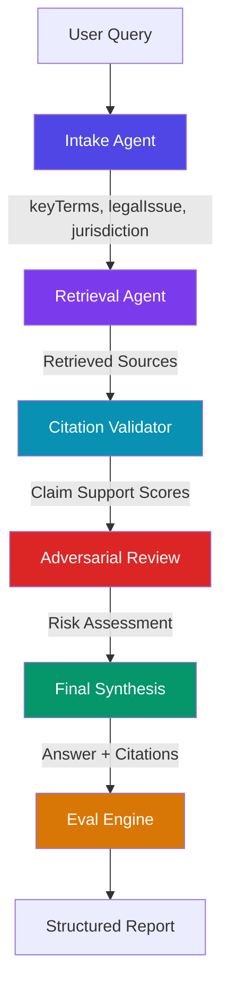

# LexOrchestrator

**Multi-Agent Litigation Reliability Engine**

LexOrchestrator is a full-stack demonstration of how multi-agent AI orchestration can improve reliability in legal research workflows. It is not a generic PDF chatbot — it is an opinionated pipeline that treats every legal query as a litigation risk surface and subjects it to structured validation before surfacing an answer.

> ⚠️ **Disclaimer**: All legal snippets in this project are sample educational content only. They are not real legal authority, case law, or professional legal advice. Do not rely on this system for actual legal matters.

---

## Why Legal AI Needs Orchestration and Evals

A single LLM call produces plausible-sounding legal text with no guarantees of:
- **Groundedness** — is the answer supported by real authority?
- **Citation accuracy** — do the cited cases actually say what is claimed?
- **Adversarial resilience** — would the position survive opposing counsel's scrutiny?
- **Hallucination detection** — which claims have no supporting source?

LexOrchestrator addresses this with a six-stage agent pipeline where each agent enriches context for the next, and a structured eval engine measures reliability at every step.

---

## Architecture



---

## Agent Pipeline

### 1. Intake Agent
Classifies the query into a legal issue category (`contract`, `tort`, `evidence`, `procedure`, `discovery`), detects jurisdiction, document type, and assigns a risk level based on trigger terms. Extracts key terms used to drive retrieval.

### 2. Retrieval Agent
Performs keyword-overlap scoring against a local corpus of 12 sample legal snippets. Returns the top 4 results with relevance scores using a TF-style weighting scheme — no external vector database required for v1.

### 3. Citation Validator
Generates 3–5 claims relevant to the detected legal issue, then checks each claim against retrieved sources. Assigns `strong`, `weak`, or `unsupported` support levels. Flags unsupported claims as hallucination risks.

### 4. Adversarial Review Agent
Acts as opposing counsel. For each legal issue type, surfaces deterministic weaknesses, missing authority gaps, and viable counterarguments. Derives an overall adversarial risk level from the citation validation score.

### 5. Final Synthesis Agent
Produces a structured legal analysis citing retrieved source IDs inline. Computes a confidence score combining citation support and adversarial risk. Surfaces unresolved questions and risk flags.

### 6. Eval Engine
Scores the full pipeline run on six dimensions:
- `groundednessScore` — fraction of claims with at least weak support
- `citationAccuracyScore` — fraction of cited IDs present in retrieved sources
- `hallucinationRisk` — categorical risk based on unsupported claim count
- `retrievalCoverage` — retrieved sources as a fraction of total corpus
- `finalAnswerConfidence` — from synthesis agent
- `overallReliability` — weighted composite of all scores

---

## Response Shape

```ts
{
  query: string,
  intake: {
    legalIssue, jurisdiction, documentType, riskLevel,
    queryClassification, keyTerms, confidence
  },
  retrievedSources: [{ id, title, text, relevanceScore, ... }],
  citationValidation: {
    claims: [{ claim, supportingCitationId, supportStrength, flag }],
    overallScore, flags, supportedCount, unsupportedCount
  },
  adversarialReview: {
    weaknesses, missingAuthority, counterarguments, overallRisk, summary
  },
  finalAnswer: {
    answer, citations, confidenceScore, riskFlags, unresolvedQuestions
  },
  evalReport: {
    groundednessScore, citationAccuracyScore, hallucinationRisk,
    retrievalCoverage, finalAnswerConfidence, overallReliability
  },
  executionTrace: [{ agent, durationMs, status }]
}
```

---

## Local Development

### Prerequisites
- Node.js 18+
- npm 9+

### Setup

```bash
git clone https://github.com/your-username/LexOrchestrator.git
cd LexOrchestrator
npm install
npm run dev
```

Open [http://localhost:3000](http://localhost:3000).

### Build

```bash
npm run build
npm run start
```

### Lint

```bash
npm run lint
```

---

## Demo Query

Paste this into the query box to see the full pipeline in action:

> **"What are the evidentiary standards for admitting expert testimony in federal civil litigation?"**

Expected behavior:
- Intake classifies: `evidence` · `Federal` · `medium` risk
- Retrieval returns: `SAMPLE-003` (Daubert), `SAMPLE-004` (expert qualification), `SAMPLE-011` (Frye)
- Citation Validator: strong support for core admissibility claims
- Adversarial Review: flags Daubert vs. Frye circuit split, ipse dixit challenge risk
- Final Synthesis: cites all three sources with inline references
- Eval: high groundedness, low hallucination risk

---

## Tech Stack

| Layer | Technology |
|-------|-----------|
| Framework | Next.js 16+ (App Router) |
| Language | TypeScript |
| Styling | Tailwind CSS |
| API | Next.js Route Handlers |
| Agents | Pure TypeScript functions (deterministic) |
| Data | Local TypeScript corpus (no DB) |

---

## Project Structure

```
app/
  layout.tsx              Root layout
  page.tsx                Main UI
  globals.css             Tailwind base styles
  api/orchestrate/
    route.ts              POST endpoint — runs the pipeline
components/
  AgentCard.tsx           Reusable agent status card
  AgentTimeline.tsx       Ordered pipeline visualization
  FinalAnswerPanel.tsx    Legal answer with citations
  EvalReportPanel.tsx     Metric grid with progress bars
  SourcesPanel.tsx        Collapsible retrieved sources
lib/
  types.ts                All shared TypeScript interfaces
  agents/
    intakeAgent.ts        Query classification + key term extraction
    retrievalAgent.ts     Keyword-scored corpus retrieval
    citationValidator.ts  Claim-to-source support scoring
    adversarialReview.ts  Opposing-counsel simulation
    finalSynthesis.ts     Cited answer generation
  orchestrator/
    pipeline.ts           Sequential agent orchestration with timing
  data/
    legalCorpus.ts        12 sample legal snippets (SAMPLE-001..012)
  evals/
    evalEngine.ts         Structured reliability scoring
```

---

## Future Roadmap

- [ ] **Vector retrieval** — Replace keyword scoring with Pinecone or pgvector embeddings
- [ ] **Real citation parser** — Integrate with legal citation databases (Westlaw/Lexis API)
- [ ] **Judge simulation agent** — Model how a court might rule on a motion
- [ ] **MCP tool routing** — Use Model Context Protocol to dynamically select retrieval tools
- [ ] **Eval dataset** — Build a labeled test set of queries with ground-truth citations
- [ ] **Document upload** — Accept briefs and motions as input for context-aware analysis
- [ ] **Clio / iManage integration** — Connect to legal practice management systems
- [ ] **Streaming agent updates** — SSE-based real-time agent step reveals
- [ ] **Multi-jurisdiction support** — Jurisdiction-aware authority ranking
- [ ] **Confidence calibration** — Fine-tune scoring weights against real legal expert labels

---

## Corpus Coverage

The sample corpus covers the following legal topics across 12 entries (SAMPLE-001 through SAMPLE-012):

| ID | Topic |
|----|-------|
| SAMPLE-001 | Breach of contract — elements |
| SAMPLE-002 | Negligence — duty of care |
| SAMPLE-003 | Expert testimony — Daubert standard |
| SAMPLE-004 | Expert testimony — qualification |
| SAMPLE-005 | Discovery — proportionality |
| SAMPLE-006 | Summary judgment standard |
| SAMPLE-007 | Motion to dismiss — 12(b)(6) |
| SAMPLE-008 | Appellate review — abuse of discretion |
| SAMPLE-009 | Contract damages — direct vs. consequential |
| SAMPLE-010 | Negligence — proximate cause |
| SAMPLE-011 | Expert testimony — Frye standard |
| SAMPLE-012 | Discovery — attorney-client privilege |

All entries are labeled as sample educational content and are not real legal authority.
