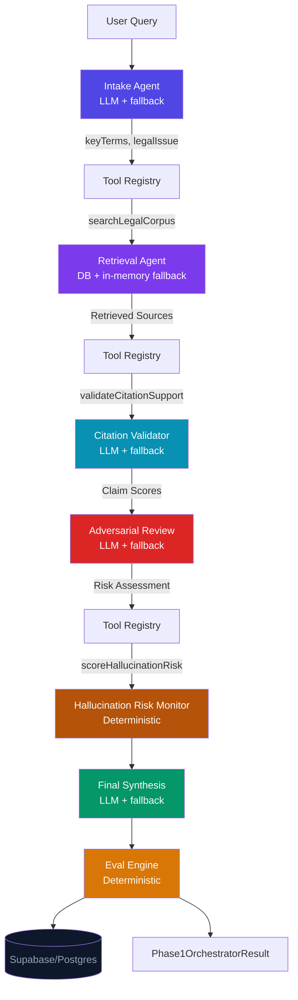

# LexOrchestrator

**Multi-Agent Litigation Reliability Engine — Phase 1**

LexOrchestrator is a full-stack multi-agent AI system for legal research reliability. It routes legal queries through a sequential agent pipeline — intake classification, RAG retrieval, citation validation, adversarial review, hallucination risk scoring, and eval reporting — before producing a final cited answer.

This is a prototype for litigation AI reliability architecture. It is not a production legal service and does not provide legal advice.

> ⚠️ **Disclaimer**: All corpus entries are sample educational content only. Not real legal authority, case law, or professional legal advice.

---

## What Is Real in Phase 1

| Capability | Status |
|-----------|--------|
| Supabase/Postgres persistence (runs, traces, citations, eval scores) | ✅ Real |
| DB-backed retrieval with in-memory fallback | ✅ Real |
| OpenAI-compatible LLM calls (intake, citation validation, adversarial review, synthesis) | ✅ Real (with mock fallback) |
| Deterministic hallucination risk scoring | ✅ Real |
| Tool registry (MCP-inspired, 4 tools) | ✅ Real |
| Sequential orchestration with per-step tracing | ✅ Real |
| Run history API (`GET /api/runs`, `GET /api/runs/[id]`) | ✅ Real |
| Eval report with groundedness, citation accuracy, reliability score, pass/fail | ✅ Real |
| Auth / user accounts | ❌ Future |
| pgvector semantic search | ❌ Future |
| Document upload | ❌ Future |

---

## Architecture



---

## Database Schema

Seven tables in Supabase/Postgres:

| Table | Purpose |
|-------|---------|
| `legal_documents` | Parent records for corpus entries |
| `legal_chunks` | Searchable text units with `citation_id` (SAMPLE-XXX) |
| `orchestration_runs` | One row per query — status, confidence, hallucination risk |
| `agent_traces` | One row per agent step per run — input/output summaries, payloads |
| `retrieval_results` | Which chunks were retrieved for each run |
| `citation_validations` | Per-claim support status (verified/partial/unsupported) |
| `eval_reports` | Reliability metrics — groundedness, citation accuracy, pass/fail |

Apply schema: paste `supabase/migrations/001_lexorchestrator_phase1.sql` into the Supabase SQL Editor.

---

## Environment Variables

Create `.env.local` in the project root:

```env
# Supabase (required for persistence)
NEXT_PUBLIC_SUPABASE_URL=https://your-project.supabase.co
NEXT_PUBLIC_SUPABASE_ANON_KEY=eyJ...
SUPABASE_SERVICE_ROLE_KEY=eyJ...

# LLM (optional — falls back to deterministic mock if absent)
OPENAI_API_KEY=sk-...
LLM_MODEL=gpt-4o-mini
```

**Fallback behavior when keys are missing:**
- No `SUPABASE_*`: app runs, pipeline completes, returns `persisted: false`
- No `OPENAI_API_KEY`: agents use deterministic mock outputs, full pipeline still works

---

## Local Development

### Prerequisites
- Node.js 18+
- npm 9+
- Supabase project (free tier works)

### Setup

```bash
git clone https://github.com/your-username/LexOrchestrator.git
cd LexOrchestrator
npm install
cp .env.local.example .env.local   # fill in your keys
npm run dev
```

Open [http://localhost:3000](http://localhost:3000).

### Apply Database Migration

Paste the contents of `supabase/migrations/001_lexorchestrator_phase1.sql` into your Supabase project's SQL Editor and run it.

### Seed Legal Corpus

```bash
npm run seed:legal
```

This idempotently seeds 12 sample educational chunks into `legal_documents` and `legal_chunks`.

---

## API Reference

### `POST /api/orchestrate`

Runs the full 7-agent pipeline. Returns a `Phase1OrchestratorResult`.

```json
// Request
{ "query": "What are the evidentiary standards for expert testimony in federal court?" }

// Response shape
{
  "runId": "uuid",
  "query": "...",
  "intake": { "legalIssue", "jurisdiction", "riskLevel", "keyTerms", ... },
  "retrievedSources": [{ "citationId", "title", "text", "relevanceScore", ... }],
  "citationValidation": { "claims": [{ "claim", "citationId", "supportStatus", "supportScore", "explanation" }], "overallScore", ... },
  "hallucinationRisk": { "riskScore", "riskLevel", "factors", "unsupportedCitationCount" },
  "adversarialReview": { "weaknesses", "missingAuthority", "counterarguments", "overallRisk", "summary" },
  "finalAnswer": { "answer", "citations", "confidenceScore", "riskFlags", "unresolvedQuestions" },
  "evalReport": { "groundednessScore", "citationAccuracyScore", "hallucinationRiskScore", "retrievalCoverage", "finalAnswerConfidence", "overallReliability", "passFail" },
  "executionTrace": [{ "agent", "durationMs", "status" }],
  "persisted": true,
  "modelUsed": "gpt-4o-mini"
}
```

### `GET /api/runs`

Returns the 20 most recent orchestration runs.

### `GET /api/runs/[id]`

Returns full run detail: orchestration run + all agent traces + retrieval results + citation validations + eval report.

---

## Tech Stack

| Layer | Technology |
|-------|-----------|
| Framework | Next.js 16+ (App Router, Turbopack) |
| Language | TypeScript (strict) |
| Styling | Tailwind CSS |
| Database | Supabase / Postgres |
| LLM | OpenAI-compatible API (gpt-4o-mini default) |
| Agents | Async TypeScript functions with LLM + deterministic fallback |
| Tool Registry | MCP-inspired, 4 tools |

---

## Demo Query

> **"What are the evidentiary standards for admitting expert testimony in federal civil litigation?"**

With keys configured:
- Intake (GPT): `evidence / Federal / medium risk`
- Retrieval (DB): SAMPLE-003 (Daubert), SAMPLE-004, SAMPLE-011 (Frye)
- Citation Validator (GPT): `verified` support for core admissibility claims
- Adversarial (GPT): Daubert/Frye circuit split, ipse dixit risk
- Hallucination Risk: score ≤ 0.2 (low)
- Synthesis (GPT): cited 3-paragraph analysis
- Eval: `pass` — high groundedness, low hallucination risk
- All persisted to Supabase

---

## Future Roadmap

- [ ] **pgvector semantic retrieval** — replace keyword scoring with cosine similarity
- [ ] **Pinecone integration** — external vector store for large corpora
- [ ] **Real citation parser** — validate against Westlaw/Lexis APIs
- [ ] **Judge simulation agent** — 8th agent modeling court disposition
- [ ] **Streaming via SSE** — real-time per-agent reveal in the UI
- [ ] **MCP server** — expose tool registry as a real MCP endpoint
- [ ] **Eval dataset** — labeled queries with ground-truth citation outcomes
- [ ] **Document upload** — user-supplied briefs as retrieval corpus
- [ ] **Clio / iManage integration** — connect to practice management systems
- [ ] **Multi-user auth** — Supabase RLS for user-scoped runs
- [ ] **Confidence calibration** — fine-tune weights against expert-labeled data

---

## Project Structure

```
supabase/
  migrations/
    001_lexorchestrator_phase1.sql    DB schema
scripts/
  seed-legal-corpus.ts               Seeds 12 sample chunks
app/
  layout.tsx / page.tsx / globals.css
  api/
    orchestrate/route.ts             POST — runs full pipeline
    runs/route.ts                    GET — recent run list
    runs/[id]/route.ts               GET — run detail
lib/
  types.ts                           All shared interfaces
  db/supabaseServer.ts               Server-only Supabase client + helpers
  llm/llmClient.ts                   OpenAI wrapper with mock fallback
  retrieval/searchLegalCorpus.ts     DB-backed retrieval with in-memory fallback
  tools/toolRegistry.ts              MCP-inspired tool registry (4 tools)
  agents/
    intakeAgent.ts                   Query classification (LLM + fallback)
    retrievalAgent.ts                Corpus retrieval (DB + fallback)
    citationValidator.ts             Claim support scoring (LLM + fallback)
    hallucinationRiskAgent.ts        Numeric risk scoring (deterministic)
    adversarialReview.ts             Opposing counsel sim (LLM + fallback)
    finalSynthesis.ts                Cited answer generation (LLM + fallback)
  orchestrator/
    pipeline.ts                      Sync mock pipeline (v1, kept for reference)
    runOrchestration.ts              Async DB+LLM pipeline (Phase 1 live path)
  evals/evalEngine.ts                Reliability scoring + pass/fail
  data/legalCorpus.ts                In-memory corpus (retrieval fallback)
```
